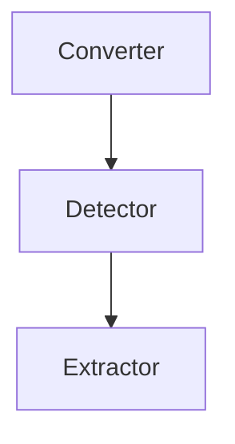

# Table Extraction

The main objects in systems:



Converter - converts a PDF file into an image, so that the resulting image can be passed to a model that is capable of 
detecting objects within it.

Detector - a model that identifies the coordinates of a table.

Extractor - extracts a table from a PDF file based on the table coordinates.

## Description of the architecture

A microservices architecture was chosen due to the following reasons:
1. Potentially, it is possible to use various programming languages. For example, there is a library called tabula-py, 
which is used for extracting tables from PDFs. It is a wrapper around a Java implementation. With a microservices 
architecture, we can implement a native version in Java, while other services can be written in Python
2. Scalability. The most essential and necessary services can be supplemented and expanded when the need arises.
3. Greater ease of extensibility.
4. High fault tolerance.
5. All functionality that requires significant resources is moved to separate services that operate in an isolated 
environment, so as not to consume resources from other parts of the project. For example, we have done this with our 
model that determines the coordinates of a table.

gRPC is used as the protocol for inter-service communication. In addition, a REST API gateway written in FastAPI is 
used as a single entry point for all services. This has been done for the convenience of interacting with the services, 
and the gateway also enables interaction with the services using JSON.

## Some details about how the services work.

After the converter has turned the PDF file into an image (obtained from a link), the resulting image is saved to the 
third-party `ImageKit` storage. To locate the table within the image, a pre-trained `Table Transformer` model is used
([more information](https://huggingface.co/docs/transformers/model_doc/table-transformer)). To extract the table, the PDF file is cropped to include only the table, and then the 
`camelot-py` library is utilized. It also can extract implicit tables. The extracted table is output in JSON format, which can then be converted into a 
`pandas.DataFrame`

## Endpoints on the API gateway (The Swagger documentation is available)

1. `converter/convert-pdf-to-image`

Request body:

```json
{
  "pdf_url": "string"
}
```

Response body:

```json
{
  "image_url": "string"
}
```

2. `detector/detect-table_area`

Request body:

```json
{
  "image_url": "string"
}
```

Response body:

```json
{
  "table_coordinates": [
    0
  ]
}
```

3. `extractor/extract_table_from_pdf`

Request body:

```json
{
  "pdf_url": "string",
  "table_coordinates": [
    0
  ]
}
```

Response body:

```json
"string"
```

4. `pipeline/extract`

Request body:

```json
{
  "pdf_url": "string"
}
```

Response body:

```json
"string"
```

## Extract from scanned pdf

This part was not implemented, but to implement it, the following needs to be done:
1. Use an existing service to translate the PDF file into an image
2. Next, we will find the coordinates of the table. We also have a ready-made service for this.
3. Implement a new service that extracts text from the image. To do this, we will use the `Pytesseract` library, 
which is used for optical character recognition (OCR). `Pytesseract` allows saving text in PDF format. We need to find an 
external API that allows storing PDF files.
4. Next, use a service to extract the table. Now coordinates of the table it's top left and right bottom coordinates of
pdf